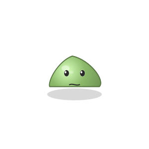
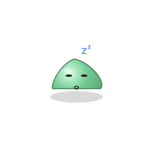
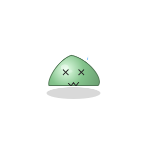
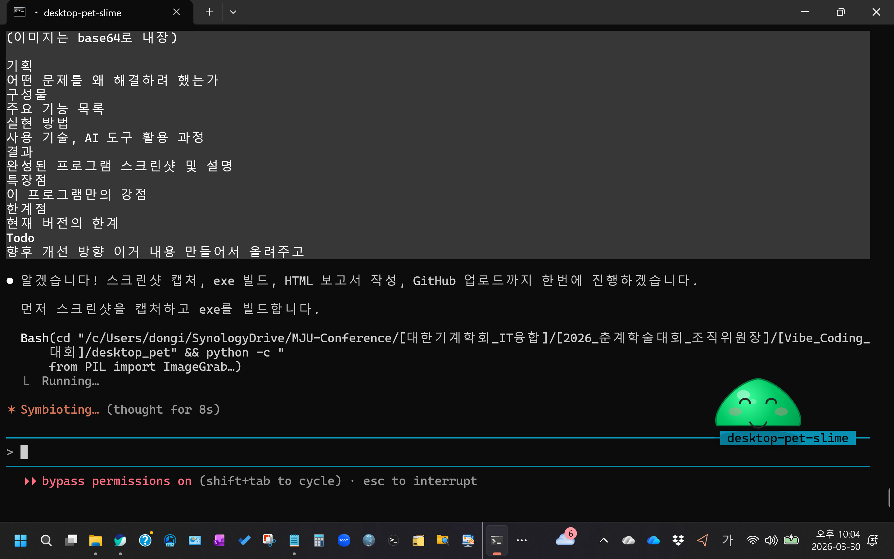

# Desktop Pet Slime

<div align="center">


**바탕화면에 살아있는 슬라임 캐릭터가 시스템 상태를 모니터링하는 Windows 데스크톱 유틸리티**

*2026 대한기계학회 춘계학술대회 Vibe Coding 경진대회 출품작*

</div>

---

## 1. 기획

### 어떤 문제를 왜 해결하려 했는가

현대인들은 컴퓨터 앞에서 장시간 작업하면서 **시스템 리소스 상태를 직관적으로 파악하기 어렵고**, 휴식 타이밍을 놓치기 쉽습니다. 기존의 시스템 모니터링 도구는 딱딱한 숫자와 그래프로만 정보를 제공하여 사용자 친화적이지 않습니다.

**Desktop Pet Slime**은 귀여운 슬라임 캐릭터가 바탕화면에 살면서 시스템 상태를 **감정과 행동으로 표현**합니다. CPU가 높으면 스트레스 받고, RAM이 부족하면 배고파하는 등 직관적인 피드백을 제공합니다. 또한 장시간 앉아있으면 스트레칭을 권유하여 사용자의 건강까지 챙깁니다.

딱딱한 모니터링 도구 대신, **매일 함께하고 싶은 데스크톱 친구**를 만들고자 했습니다.

---

## 2. 구성물 - 주요 기능 목록

| 기능 | 설명 |
|------|------|
| **실시간 시스템 모니터링** | CPU, RAM, 디스크, 네트워크, 배터리를 실시간 감시하여 슬라임의 상태에 반영 |
| **8가지 감정 표현** | IDLE, HAPPY, STRESSED, SLEEPY, HUNGRY, SICK, PETTED, STRETCHING 상태별 표정 변화 |
| **미니게임** | 슬라임 먹이주기 게임: 마우스/키보드로 슬라임을 움직여 음식을 받아먹는 아케이드 게임 |
| **스마트 알림** | 장시간 작업 시 휴식 알림, 배터리 부족 경고, 예약 리마인더 기능 |
| **풍부한 상호작용** | 클릭으로 쓰다듬기, 드래그로 이동, 더블클릭으로 미니게임, 눈이 마우스를 따라감 |
| **커스텀 설정** | 슬라임 크기, 알림 간격, 항상 위 표시, Windows 시작 시 자동실행 설정 |

---

## 3. 실현 방법

### 사용 기술

| 기술 | 용도 |
|------|------|
| Python 3.11 | 메인 언어 |
| PyQt6 | GUI 프레임워크, 투명 윈도우 |
| QPainter | 슬라임 캐릭터 실시간 렌더링 |
| psutil | CPU/RAM/디스크/네트워크/배터리 모니터링 |
| ctypes (Win32 API) | 사용자 유휴 시간 감지 |
| PyInstaller | 단일 exe 패키징 |
| Claude Code (AI) | 바이브 코딩 - 전체 개발 과정 |

### AI 도구 활용 과정

| 단계 | 내용 |
|------|------|
| **1. 아이디어 브레인스토밍** | Claude Code와 대화하며 대회 우승 가능한 참신한 아이디어 도출. 데스크톱 펫 + 시스템 모니터라는 독창적 조합 결정. |
| **2. 설계 (Plan Mode)** | Claude Code의 Plan Mode를 활용하여 프로젝트 구조, 클래스 설계, 애니메이션 시스템, 구현 순서를 체계적으로 설계. |
| **3. 코드 구현** | 모듈별로 순차적 구현: 투명 윈도우 → 슬라임 렌더링 → 시스템 모니터링 → 상호작용 → 미니게임 → 설정 |
| **4. 테스트 & 리팩토링** | 실시간 실행 테스트를 통한 버그 수정 및 미니게임 조작 방식 개선 (클릭 → 마우스 이동 방식으로 전환). |
| **5. 빌드 & 배포** | PyInstaller를 이용한 단일 exe 패키징, GitHub 릴리스 생성, 프로젝트 보고서 작성. |

---

## 4. 결과

### 슬라임 상태 변화

시스템 리소스 상태에 따라 슬라임의 색상, 표정, 행동이 실시간으로 변합니다.

<div align="center">

<table>
<tr>
<td align="center"><br><b>IDLE</b><br>기본</td>
<td align="center"><br><b>HAPPY</b><br>여유</td>
<td align="center"><br><b>STRESSED</b><br>과부하</td>
<td align="center"><br><b>SLEEPY</b><br>유휴</td>
</tr>
<tr>
<td align="center"><br><b>HUNGRY</b><br>메모리 부족</td>
<td align="center"><br><b>SICK</b><br>디스크 부족</td>
<td align="center"><br><b>PETTED</b><br>쓰다듬기</td>
<td align="center"></td>
</tr>
</table>

</div>

### 바탕화면 위의 슬라임

<div align="center">

<br><i>바탕화면 우측 하단에 위치한 Desktop Pet Slime</i>
</div>

### 조작법

| 조작 | 동작 |
|------|------|
| **클릭** | 쓰다듬기 (하트 + 흔들림) |
| **드래그** | 바탕화면 이동 |
| **더블클릭** | 미니게임 실행 |
| **우클릭** | 메뉴 (System Info, Mini Game, Reminder, Settings, Quit) |

---

## 5. 특장점

- **100% 프로그래밍 드로잉** - 스프라이트 이미지 없이 QPainter로 모든 그래픽을 실시간 렌더링. 상태 전환이 부드럽고 해상도에 무관.
- **직관적 시스템 모니터링** - 숫자와 그래프 대신 캐릭터의 감정으로 시스템 상태를 전달. 모니터 한 구석만 봐도 PC 상태를 직감적으로 파악 가능.
- **풍부한 애니메이션** - 바운스, 흔들림, 깜빡임, 색상 보간 전환, 파티클 시스템 등 30FPS 실시간 애니메이션. 눈이 마우스 커서를 따라가는 디테일.
- **미니게임 내장** - 60FPS 아케이드 게임 내장. 콤보 시스템, 폭탄 회피, 난이도 자동 증가, 점수별 등급 평가.
- **최소 의존성** - PyQt6 + psutil 단 2개 외부 패키지만 사용. 단일 exe 파일로 배포 가능.
- **건강 관리** - 장시간 컴퓨터 사용 시 자동 스트레칭 알림. 배터리 부족 경고. 사용자의 건강과 생산성을 챙기는 유틸리티.

---

## 6. 한계점

- **Windows 전용** - Win32 API(GetLastInputInfo)를 사용하여 현재 Windows에서만 동작합니다.
- **단일 캐릭터** - 현재 슬라임 캐릭터만 제공됩니다. 캐릭터 선택 기능이 없습니다.
- **사운드 미지원** - 효과음이나 배경음이 없어 시각적 피드백에만 의존합니다.
- **미니게임 1종** - 먹이주기 게임 1개만 제공됩니다.
- **메모리 사용량** - PyQt6 기반이라 일반 네이티브 앱 대비 메모리 사용량이 다소 높습니다.

---

## 7. Todo - 향후 개선 방향

- [ ] **캐릭터 확장** - 고양이, 로봇, 용 등 다양한 캐릭터 선택 기능 추가
- [ ] **사운드 효과** - 상태 변화, 쓰다듬기, 미니게임에 효과음 추가
- [ ] **추가 미니게임** - 슬라임 점프, 퀴즈, 타자 연습 등 다양한 게임 추가
- [ ] **크로스 플랫폼** - macOS, Linux 지원을 위한 플랫폼 추상화
- [ ] **성장 시스템** - 슬라임이 시간이 지남에 따라 성장하고 진화하는 시스템
- [ ] **테마/스킨** - 슬라임 색상, 악세사리 커스터마이징
- [ ] **위젯 모드** - 시계, 날씨, 할일 목록 등 미니 위젯 기능 추가
- [ ] **AI 대화** - LLM 연동으로 슬라임과 대화할 수 있는 기능

---

## 실행 방법

### exe 파일 (권장)
[Releases](../../releases)에서 DesktopPetSlime.exe를 다운로드하여 실행

### Python으로 실행
```bash
pip install PyQt6 psutil
python main.py
```

---

<div align="center">

**Desktop Pet Slime v1.0** - Built with Vibe Coding (Claude Code AI)

2026 KSME Spring Conference · Vibe Coding Competition

</div>
